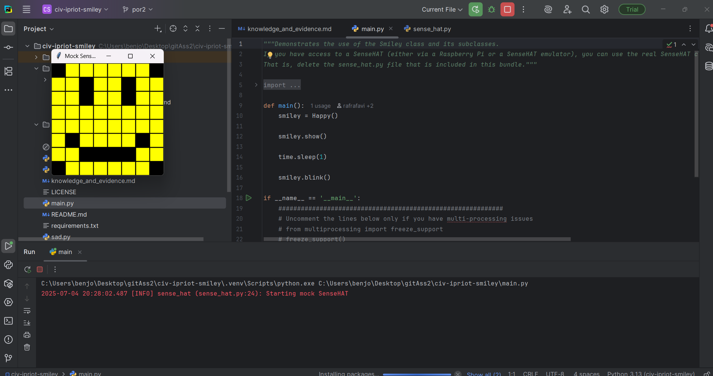
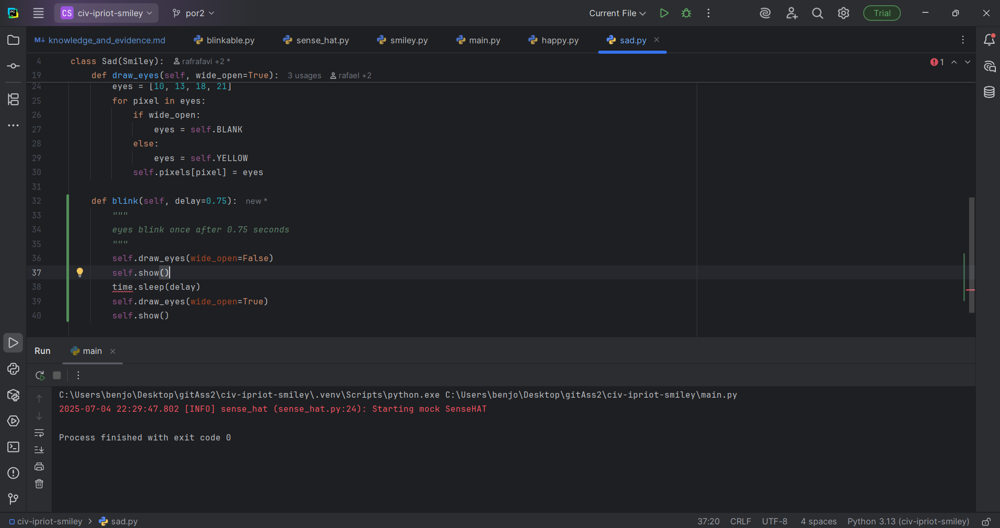
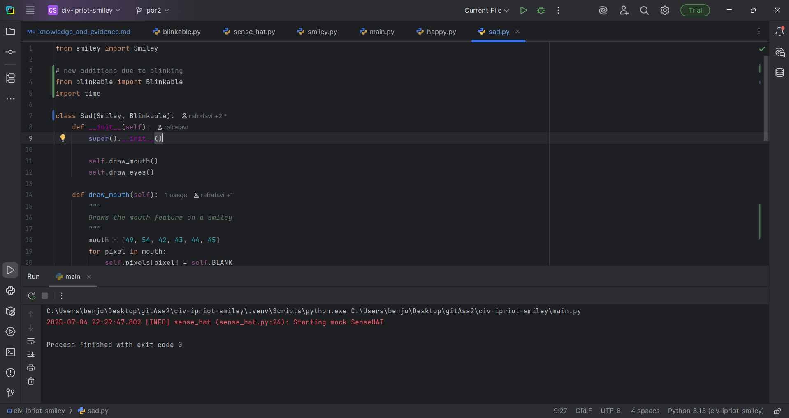
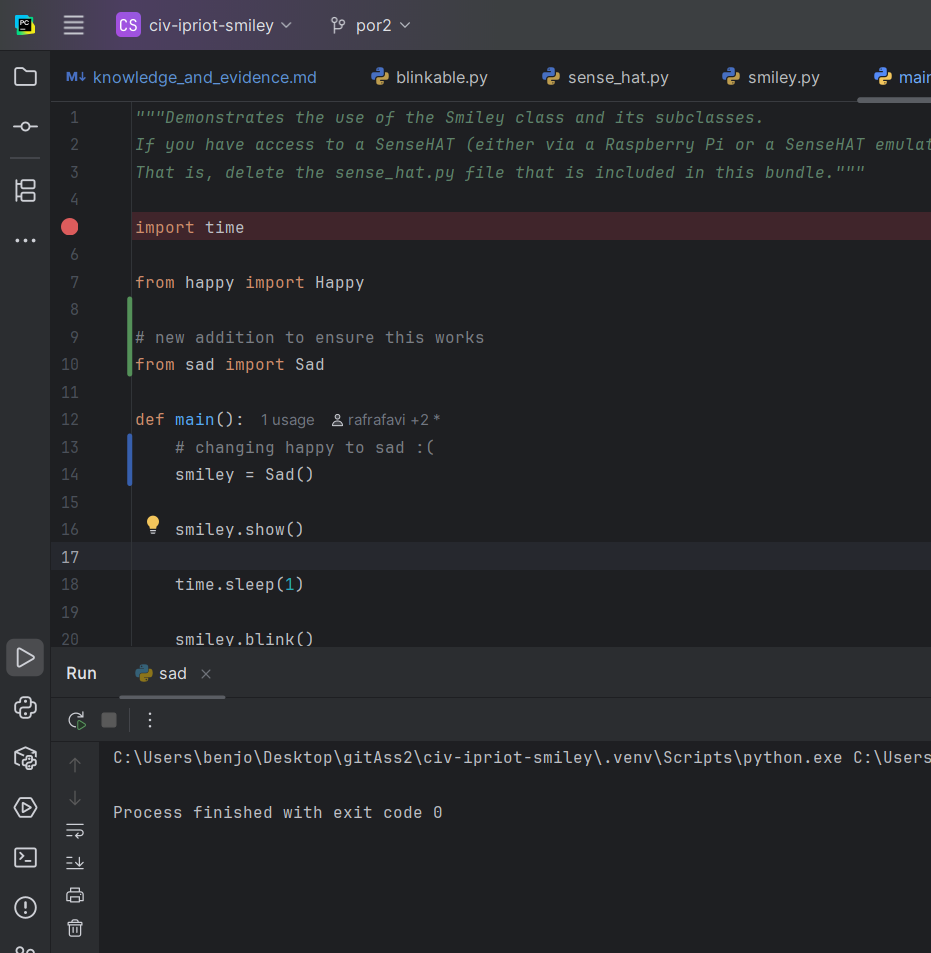
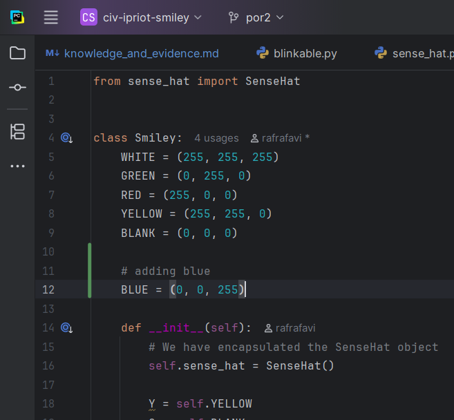
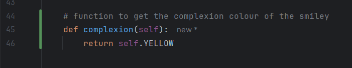
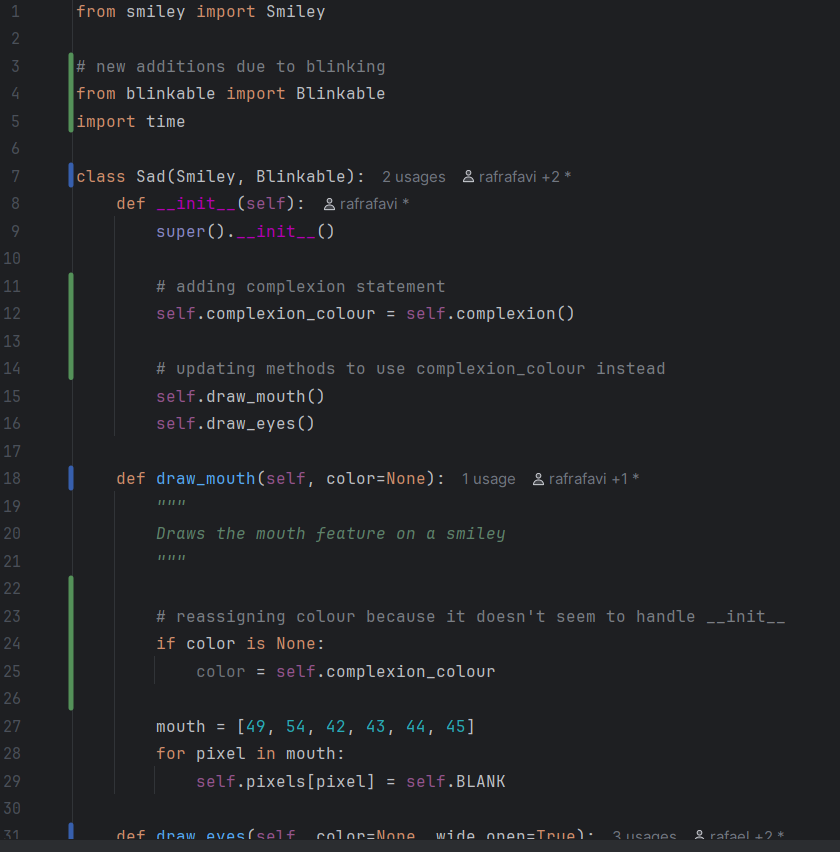
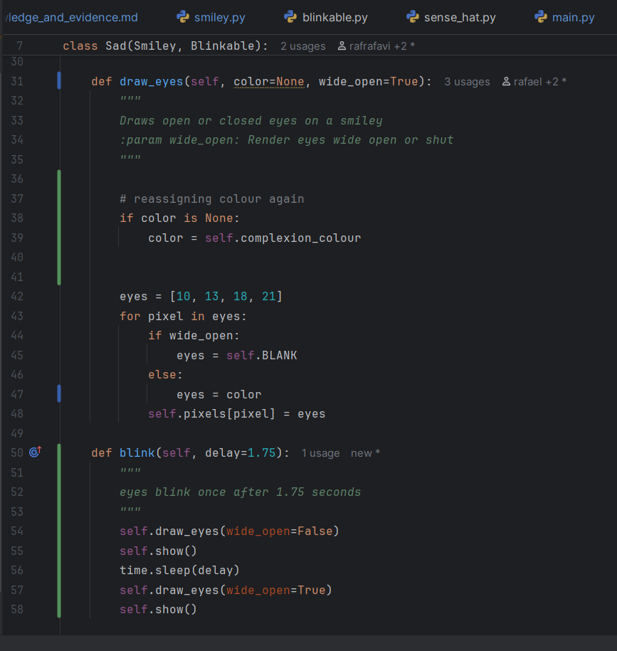
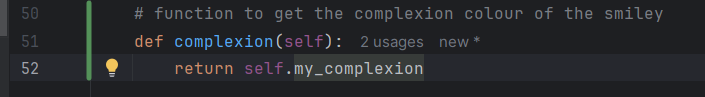

# Evidence and Knowledge

This document includes instructions and knowledge questions that must be completed to receive a *Competent* grade on this portfolio task.

## 1. Required evidence

### 1.1. Answer all questions in this document

- Each answer should be complete, well-articulated, and within the specified word count limits (if added) for each question.
- Please make sure **all** external sources are properly cited.
- You must **use your own words**. Please include your full chat transcripts if you use generative AI in any way.
- Generative AI hallucinates, is not an authoritative source

### 1.2. Make all the required modifications to the code

- Please follow the instructions in this document to make the changes needed to the code.

- When requested to upload evidence, upload all screenshots to `screenshots/` and embed them in this document. For example:

```markdown

```


> Note the `!`, and the use of a relative path.

- You must upload the code into your GitHub repository.
- While you can use a branch, your code should be in main when you submit.
- Upload a zip of this repository to Blackboard when you are ready to submit.
- You will be notified of your result via Blackboard
- However, if using GitHub classrooms, you may also receive additional feedback on GitHub directly

### 1.3. Optional: Use of Raspberry Pi and SenseHat

Raspberry Pi or SenseHat is **optional** for this activity. You can use the included `sense_hat.py` file to simulate the SenseHat on your computer.

If you use a Pi, please **delete** the `sense_hat.py` file.

### 1.4. Accessible version of the code

This project relies on visual patterns that appear on an LED matrix. If you have any accessibility requirements, you can use the `udl/accessible` branch to complete the project. This branch provides an accessible code version that uses text-based patterns instead of visual ones.

Please discuss this with your lecturer before using that branch.

## 2. Specific Tasks & Questions

Address the following tasks and questions based on the code provided in this repository.

### 2.1. Set up the project locally

1. Fork this repository (if not using GitHub Classrooms)
2. Clone your repository locally
3. Run the project locally by executing the `main.py` file
4. Evidence this by providing screenshots of the project directory structure and the output of the `main.py` file




If you are running on a Raspberry Pi, you can use the following command to run the project and then screenshot the result:

```bash
ls
python3 main.py
```

### 2.2. Fundamental code comprehension

 Answer each of the following questions **as they relate to that code** supplied by in this repository (ignore `sense_hat.py`):

1. Examine the code for the `smiley.py` file and provide  an example of a variable of each of the following types and their corresponding values (`_` should be replaced with the appropriate values):

   | Type                    | name   | value                                           |
   | ----------              |--------|-------------------------------------------------|
   | built-in primitive type | dimmed | True                                            |
   | built-in composite type | WHITE  | (255, 255, 255)                                 |
   | user-defined type       | Smiley | the combination of all its contained attributes |

2. Fill in (`_`) the following table based on the code in `smiley.py`:

   | Object                   | Type                                    |
   | ------------             |-----------------------------------------|
   | self.pixels              | list                                    |
   | A member of self.pixels  | tuple                                   |
   | self                     | parameter referring to current instance |

3. Examine the code for `smiley.py`, `sad.py`, and `happy.py`. Give an example of each of the following control structures using an example from **each** of these files. Include the first line and the line range:

   | Control Flow | File     | First line | Line range |
   | ------------ |----------|------------|------------|
   |  sequence    | happy.py | 39         | 39-43      |
   |  selection   | sad.py   | 26         | 26-30      |
   |  iteration   | sad.py   | 16         | 16-17      |

4. Though everything in Python is an object, it is sometimes said to have four "primitive" types. Examining the three files `smiley.py`, `sad.py`, and `happy.py`, identify which of the following types are used in any of these files, and give an example of each (use an example from the code, if applicable, otherwise provide an example of your own):

   | Type                    | Used? | Example                                                                            |
   | ----------------------- |-------|------------------------------------------------------------------------------------|
   | int                     | yes   | `WHITE = (255, 255, 255)` [each number within the tuple is an int value] (smiley.py) |
   | float                   | yes   | `delay=0.25` (happy.py)                                                              |
   | str                     | no    | `how_to_get_better = "GET GOOD AT THE GAME SON"`                                      |
   | bool                    | yes   | `dimmed=True` (smiley.py)                                                            |

5. Examining `smiley.py`, provide an example of a class variable and an instance variable (attribute). Explain **why** one is defined as a class variable and the other as an instance variable.

> The class variable is defined within the class, but outside of any of the class methods, whereas the instance variable is defined within a method, typically with the `__init__` constructor and using the `self` keyword.
> A class variable in smiley.py is `WHITE`, and an instance variable is `self.sense_hat`.
> This is done so `WHITE` does not have to be defined for each instance and is instead recalled similarly for each, but `self.sense_hat` should be unique for each instance. 

6. Examine `happy.py`, and identify the constructor (initializer) for the `Happy` class:
   1. What is the purpose of a constructor (in general) and this one (in particular)?

   > A constructor is the special method `__init__`, and it is used for initializing newly created objects in a class, allowing for the assigning of variables and object configuration. 
   > 
   > The constructor for the `Happy` class is the line `def __init__(self):`, this constructs the `Happy` part specifically, which is followed by `super().__init__()` which constructs the `Smiley` part to set as reference.
   >

   2. What statement(s) does it execute (consider the `super` call), and what is the result?

   > It first executes the `super().__init__()` statement, which calls the `__init__()` method of its parent class, `Smiley`. This creates the `SenseHat` object and stores it in `self.sense_hat()`, and it also defines and stores the yellow pixel design in `self.pixels`, ready to be modified by later statements
   >
   > The next statement to be executed is `self.draw_mouth`, which modifies `self.pixels` to draw a mouth by overwriting values within itself
   >
   > The final statement to be executed is `self.draw_eyes`, which functions similarly to `self.draw_mouth`, but draws two eyes instead
### 2.3. Code style

1. What code style is used in the code? Is it likely to be the same as the code style used in the SenseHat? Give to reasons as to why/why not:

> The code style used is PEP 8. It is likely that the SenseHat also uses PEP 8 internally, as it is the industry-standard coding style for Python and is known for being very readable, which would be useful for a hardware commonly found in education.
>

2. List three aspects of this convention you see applied in the code.

> 1) Classes are done in PascalCase e.g. `Smiley`, `SenseHat`
> 2) Methods are done in snake_case e.g. `dim_display`, `draw_eyes`
> 3) Constants are done in all caps e.g. `WHITE`, `GREEN`
>

3. Give two examples of organizational documentation in the code.

> 1) `"""
   Provides a Smiley with a happy expression
    """`
> 2) ` """
       Draws the eyes (open or closed) on the standard smiley.
        :param wide_open (bool): eyes open or closed.
        """`
>

### 2.4. Identifying and understanding classes

> Note: Ignore the `sense_hat.py` file when answering the questions below

1. List all the classes you identified in the project. Indicate which classes are base classes and which are subclasses. For subclasses, identify all direct base classes.
  
  Use the following table for your answers:

| Class Name | Super or Sub? | Direct parent(s)  |
|------------|---------------|-------------------|
| NotReal    | Sub           | NotRealParent     |
| Smiley     | Super         | N/A               |
| Sad        | Sub           | Smiley, Blinkable |
| Happy      | Sub           | Smiley, Blinkable |
| Blinkable  | Super, Sub    | ABC                |
| SenseHat   | Super         | N/A               |

2. Explain the concept of abstraction, giving an example from the project (note "implementing an ABC" is **not** in itself an example of abstraction). (Max 150 words)

> Abstraction is a concept that focuses on hiding complex interaction details and only exposing the essential functionalities to the user
> 
> In the project, the function `self.pixels` is defined in the parent class `Smiley`, meaning its two children `Sad` and `Happy` must also implement this function
> 
> However, when coding `Happy` and `Sad`, they have access to the function `self.pixels` without needing to know how it's constructed, abstracting away the details on how the pixel grid is constructed etc.

3. What is the name of the process of deriving from base classes? What is its purpose in this project? (Max 150 words)

> The name of the process is Inheritance. The purpose it has in this project is to streamline the process of making new types of smiley face, or in more technical speak, children of the class `Smiley`. This means that functions such as `self.pixels` do not have to be recreated individually for each new child class.
>

### 2.5. Compare and contrast classes

Compare and contrast the classes Happy and Sad.

1. What is the key difference between the two classes?
   > `Happy` is a child of `Blinkable`, whereas `Sad` is not
   >
2. What are the key similarities?
   > Both are children of `Smiley` and are created in the same format, with calling a `super().` to construct the parent, then defining the processes of `draw_mouth` and `draw_eyes`
   >
3. What difference stands out the most to you and why?
   > `Happy` has a third method defined called `blink`, which gives cause for its parent being `Blinkable`. 
   >
4. How does this difference affect the functionality of these classes
   > This difference leads to the class `Happy` having an additional function over `Sad`, which allows `Happy` to 'blink' once, 0.25 seconds after drawing itself
   >

### 2.6. Where is the Sense(Hat) in the code?

1. Which class(es) utilize the functionality of the SenseHat?
   > The 3 classes `Smiley`, `Happy` and `Sad` utilize the functionality of the SenseHat, as they all require it in order to properly visualise themselves
   >
2. Which of these classes directly interact with the SenseHat functionalities?
   > Only 1 class directly interacts with the SenseHat functionalities - that being `Smiley`, the parent class
   >
   3. Discuss the hiding of the SenseHAT in terms of encapsulation (100-200 Words)
   >    Encapsulation is the concept of bundling data (attributes) with methods (functions) that operate on that data within a single unit, typically a class. The primary goal of encapsulisation is to control access to an object's internal state, preventing direct, unauthorized modification of its data, usually through methods like private variables
   > 
   >   In terms of hiding the SenseHat, only one class is directly linked to it - `Smiley`. The encapsulation within this project refers to how it is significantly more accessible to modify or create a new child of `Smiley` than it is to modify `sense_hat.py` directly. This dissuades users from modifying `sense_hat.py`, thus indirectly protecting its data and promoting clean, modular code

### 2.7. Sad Smileys Can’t Blink (Or Can They?)

Unlike the `Happy` smiley, the current implementation of the `Sad` smiley does not possess the ability to blink. Let's first explore how blinking has been implemented in the Happy Smiley by examining the blink() method, which takes one argument that determines the duration of the blink.

**Understanding Blink Mechanism:**

1. Does the code's author believe that every `Smiley` should be able to blink? Explain.

> Provided a `Smiley` is parented from `Blinkable`, they should all be able to blink. However, given that (in this document's original state), only `Happy` is parented from `Blinkable`, the code's author does *not* believe that every `Smiley` should be able to blink
>

2. For those smileys that blink, does the author expect them to blink in the same way? Explain.

> Within `Blinkable`, it determines the function itself and also a parameter - `delay`, which can be individually customised for each individual `Smiley`. Given there would be no purpose to this extra customisation, which required slightly more effort to code, it is reasonable to assume the author does *not* expect them to all blink in the same way
>

3. Referring to the implementation of blink in the Happy and Sad Smiley classes, give a brief explanation of what polymorphism is.

> Polymorphism is the concept that enables objects of different classes to be treated in a common way, as long as they share a common interface or behaviour, usually from inheriting the same parent class
> 
> In regard to the implementation of blinking, it means that both `Happy` and `Sad` can be parented from `Blinkable`, and in which case, both would be treated as `Blinkable` objects despite their appearances being different. This could be managed with some minor code adjustments in order to give both a shared blink rate without needing to know the exact class of each object, but rather manipulating them by their shared handle of `Blinkable`

4. How is inheritance used in the blink method, and why is it important for polymorphism?

> Inheritance is used in this method by allowing both `Happy` and `Sad` to be manipulated by the shared characteristic of being `Blinkable` instances rather than individually as separate classes. This means both classes gain access to the shared 'blink' behaviour without having to redefine it individually. This usage of inheritance is important for polymorphism, as it allows developers to streamline the creation and modification of sibling classes by simplifying code reuse and reducing the need for changing existing code
>
1. **Implement Blink in Sad Class:**

   - Create a new method called `blink` within the Sad class. Ensure you use the same method signature as in the Happy class:

   ```python
   def blink(self, delay=0.25):
       pass  # Replace 'pass' with your implementation
   ```

2. **Code Implementation:** Implement the code that allows the Sad smiley to blink. Use the implementation from the Happy Smiley as a reference. Ensure your new method functions similarly by controlling the blink duration through the `delay` argument.

3. **Testing the Implementation:**

- Test the new blink functionality on your Raspberry Pi or within the Python classes provided. You might need to adjust the `main.py` script to incorporate Sad Smiley's new blinking capability.

Include a screenshot of the sad smiley or the modified `main.py`:





- Observe and document the Sad smiley as it blinks its eyes. Describe any adjustments or issues encountered during implementation.

  > I had to edit `main.py` as well in order to run it, and I initially forgot to change it calling `Happy()` to calling `Sad`, but once I changed it, it ran completely finewith no issues

  ### 2.8. If It Walks Like a Duck…

  Previously, you implemented the blink functionality for the Sad smiley without utilizing the class `Blinkable`. Assuming you did not use `Blinkable` (even if you actually did), consider how the Sad smiley could blink similarly to the Happy smiley without this specific class.

  1. **Class Type Analysis:** What kind of class is `Blinkable`? Inspect its superclass for clues about its classification.

     > Blinkable is an Abstract Base Class, which can be understood from it inheriting `ABC`. This means it is a class that cannot be instantiated on its own. It is an ABC as it is designed to define a contract (most often a function or s) for subclasses without providing full implementation
  2. **Class Implementation:** `Blinkable` is a class intended to be implemented by other classes. What generic term describes this kind of class, which is designed for implementation by others? **Clue**: Notice the lack of any concrete implementation and the naming convention.

  > The term is Abstract Blinkable Class (ABC)

  3. **OO Principle Identification:** Regarding your answer to question (2), which Object-Oriented (OO) principle does this represent? Choose from the following and justify your answer in 1-2 sentences: Abstraction, Polymorphism, Inheritance, Encapsulation.

  >  This follows the concept of Abstraction, as it hides the complexity of how its children blink, while stating that its children *must* blink in some fashion. 

  4. **Implementation Flexibility:** Explain why you could grant the Sad Smiley a blinking feature similar to the Happy Smiley's implementation, even without directly using `Blinkable`.

  > By manually implementing the blinking code within `Sad` while *not* using `Blinkable`, the `Sad` class would not have the handle `Blinkable` despite it being able to blink. This would mean sad is not truly `Blinkable`, limiting the ability to treat it polymorphically alongside other `Blinkable` objects, allowing for it to be treated as an exception

  5. **Concept and Language Specificity:** In relation to your response to question (4), what is this capability known as, and why is it feasible in Python and many other dynamically typed languages but not in most statically typed programming languages like C#? **Clue** This concept is hinted at in the title of this section.

  > This capability is referred to as "duck typing" - a concept that if an object behaves like a certain type (i.e. it is `Blinkable`), it can be treated as that type, regardless of inheritance
  > 
  > Python supports duck typing as it is dynamically typed (it checks whether an object has a behaviour at runtime), whereas C# is a statistically typed language, meaning it checks compatability at compile time and thus requires explicit inheritance or implementation

  ***

  ## 3. Refactoring

  ### 3.1. Does a Smiley Have to Be Yellow?

  While our current implementation predominantly features yellow smileys, emotional expressions like sickness or anger typically utilize colors like green, red, or orange. We'll explore the feasibility of integrating these colors into our smileys.

  1. **Defined Colors and Their Location:**

     1. Which colors are defined and in which class(s)?
        > The colours are all defined in the class `Smiley`, and the colours that are defined are `WHITE`, `GREEN`, `RED`, `YELLOW`, and `BLANK` (black)
     2. What type of variables hold these colors? Are the values expected to change during the program's execution? Explain your answer.
        > The colour information is stored in a tuple variable composed of three individual int values. The values are *not* expected to change as tuples are immutable and therefore, unable to be changed once  created
     3. Add the color blue to the appropriate class using the appropriate format and values.

  2. **Usage of Color Variables:**

     1. In which classes are the color variables used?
        > The colour variables are directly used in all 3 classes of `Smiley`, `Happy` and `Sad`. In `Smiley`, the colour variables are used in the parameter `self.pixels`, and in both `Happy` and `Sad`, the colour variables are used in the functions `draw_eyes` and `draw_mouth`

  3. **Simple Method to Change Colors:**
  4. What is the easiest way you can think to change the smileys to green? Easiest, not necessarily the best!
     > The easiest way to change the smileys to green would be to change line 18 in `smiley.py` to:
     > 
     > `Y = self.GREEN`


  ### 3.2. Flexible Colors – Step 1

  Changing the color of the smileys once is straightforward, but it isn't very flexible. To facilitate various colors for smileys, it is advisable not to hardcode values in any class. This approach was identified earlier as a necessary change. Let's start by removing the built-in assumptions about color in our classes.

  1. **Add a method called `complexion` to the `Smiley` class:** Implement this instance method to return `self.YELLOW`. Using the term "complexion" instead of "color" provides a more abstract terminology that focuses on the meaning rather than implementation.

  2. **Refactor subclasses to use the `complexion` method:** Modify any subclass that directly accesses the color variable to instead utilize the new `complexion` method. This ensures that color handling is centralized and can be easily modified in the future.


  3. **Determine the applicable Object-Oriented principle:** Consider whether Abstraction, Polymorphism, Inheritance, or Encapsulation best applies to the modifications made in this step.
> Given that both child classes share the same inherited characteristic of `complexion`, I believe the best-applied concept is Abstraction. This is because I am allowing the modification of both children based on `complexion` without having to know how `complexion` is implemented in `Smiley`
  4. **Verify the implementation:** Ensure that the modifications function as expected. The smileys should still display in yellow, confirming that the new method correctly replaces the direct color references.

  This step is crucial for setting up a more flexible system for color management in the smiley display logic, allowing for easy adjustments and extensions in the future.

  ### 3.3. Flexible Colors – Step 2

  Having removed the hardcoded color values, we now enhance the base class to support dynamic color assignments more effectively.

  1. **Modify the `__init__()` method in the `Smiley` class:** Introduce a default argument named `complexion` and assign `YELLOW` as its default value. This allows the instantiation of smileys with customizable colors.

  2. **Introduce a new instance variable:** Create a variable called `my_complexion` and assign the `complexion` parameter to it. This step ensures that each smiley instance can maintain its own color state.

  3. **Rationale for `my_complexion`:** Using a distinct instance variable like `my_complexion` avoids potential conflicts with the method parameter names and clarifies that it is an attribute specific to the object.

  4. **Bulk rename:** We want to update our grid to use the value of complexion, but we have so many `Y`'s in the grid. Use your IDE's refactoring tool to rename all instances of the **symbol** `Y` to `X`. Where `X` is the value of the `complexion` variable. Include a screenshot evidencing you have found the correct refactor tool and the changes made.


  5. **Update the `complexion` method:** Adjust this method to return `self.my_complexion`, ensuring that whatever color is assigned during instantiation is what the smiley displays.

  6. **Verification:** Run the updated code to confirm that Smileys still defaults to yellow unless specified otherwise.

  ### 3.4. Flexible Colors – Step 3

  With the foundational changes in place, it's now possible to implement varied smiley colors for different emotional expressions.

  1. **Adjust the `Sad` class initialization:** In the `Sad` class's initializer method, change the superclass call to include the `complexion` argument with the value `self.BLUE`, as shown:

     ```python
     super().__init__(complexion=self.BLUE)
     ```

  2. **Test color functionality for the Sad smiley:** Execute the program to verify that the Sad smiley now appears blue.

  3. **Ensure the Happy smiley remains yellow:** Confirm that changes to the Sad smiley do not affect the default color of the Happy smiley, which should still display in yellow.

  4. **Design and Implement An Angry Smiley:** Create an Angry smiley class that inherits from the `Smiley` class. Set the color of the Angry smiley to red by passing `self.RED` as the `complexion` argument in the superclass call.


***